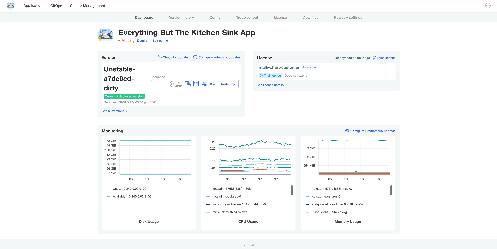
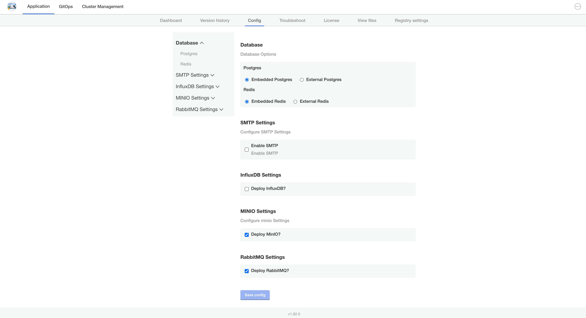
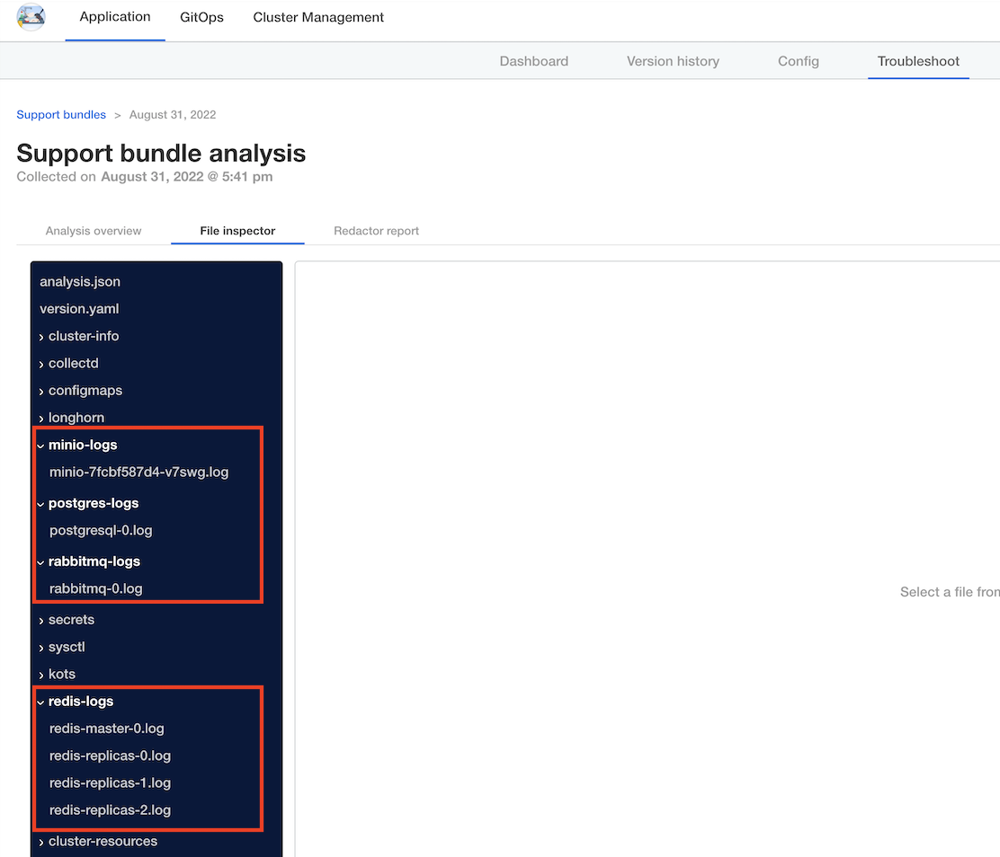

## Kitchen Sink App ##

This is a KOTS apps that contains 'everything but the kitchen sink'. It contains several commonly used open source components.

Currently it contains the following Helm Charts:

* InfluxDB
* RabbitMQ
* Redis
* Postgres
* Minio

It also contains one operator:

* Splunk

### Select Which One to Deploy ###

The Config UI of the application provides configurations to choose which of these to deploy. The Operator is not optional at this time.

The selections are wired to the `HelmChart` kinds, so the Chart is only deployed if the corresponding checkbox is checked. There are also hidden fields to generate secrets and tokens that are used during initialization. This values are preserved during upgrades.

### Support Bundle

There are log collectors set up for each service, and only run if the corresponding service is selected to be deployed in the Config UI.

